<h1 align="center">
  <a href="http://davidcobbina.com" target="_blank">davidcobbina.com</a>
</h1>

<h1 align="center">
 Flutter Catalog 
</h1>

    Flutter Catalog is a  very handy catalog of beautifully designed widgets to help ease your <strong>flutter </strong> journey.

    It is inspired by a lot of UI Kits. I will be updating the list as I build them.

<a href="https://www.behance.net/gallery/72907227/Social-Meet-Up-UI-Kit-FREE-for-Adobe-XD?tracking_source=search_projects_recommended%7Cfree%20ui%20kit" target="_blank">Social MeetUp Design</a>

 

    

# Cases Studies
 

# Drop Case Study
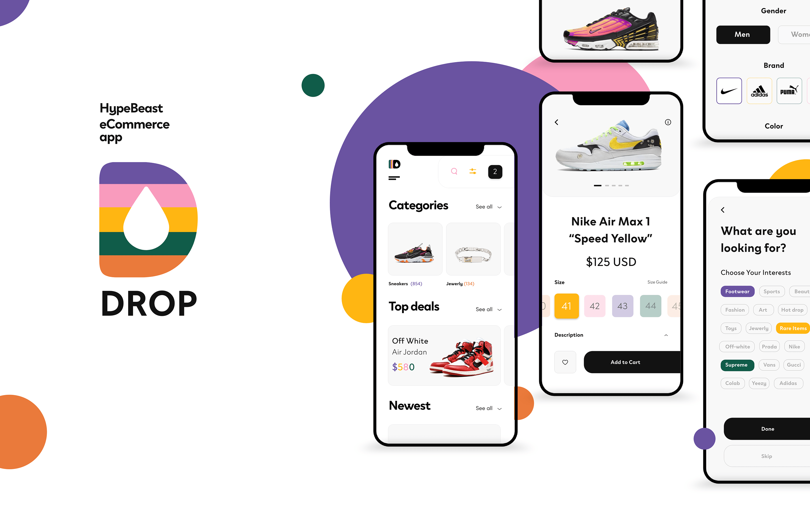
 

# Roam Case Study
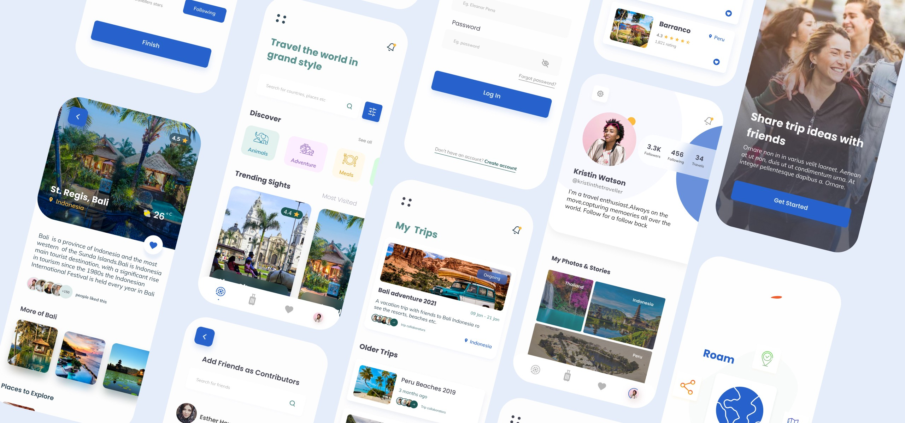
 

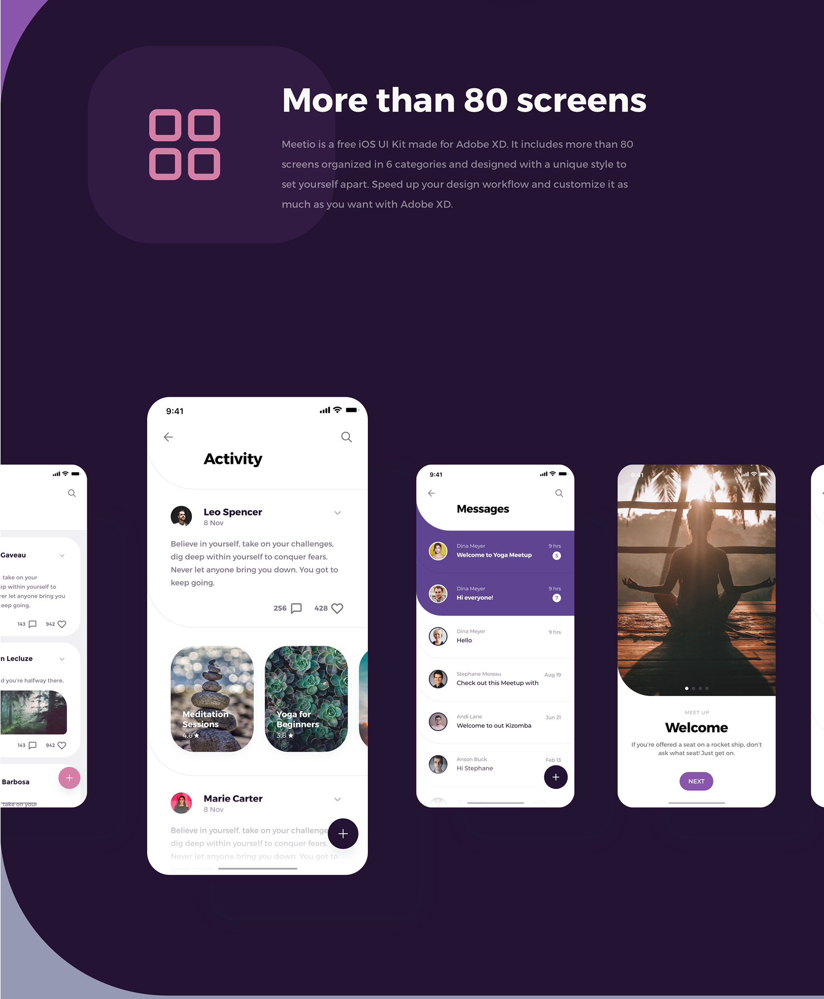
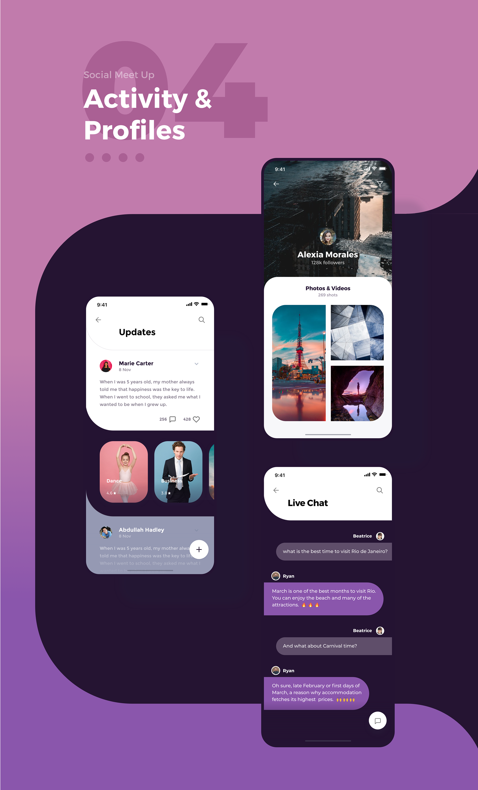
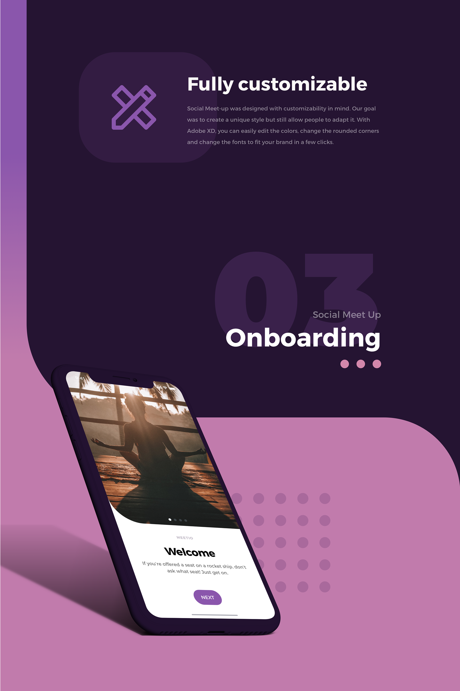
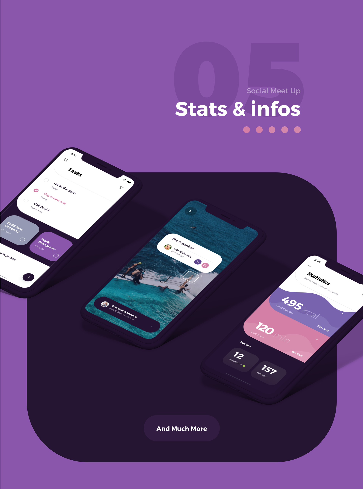
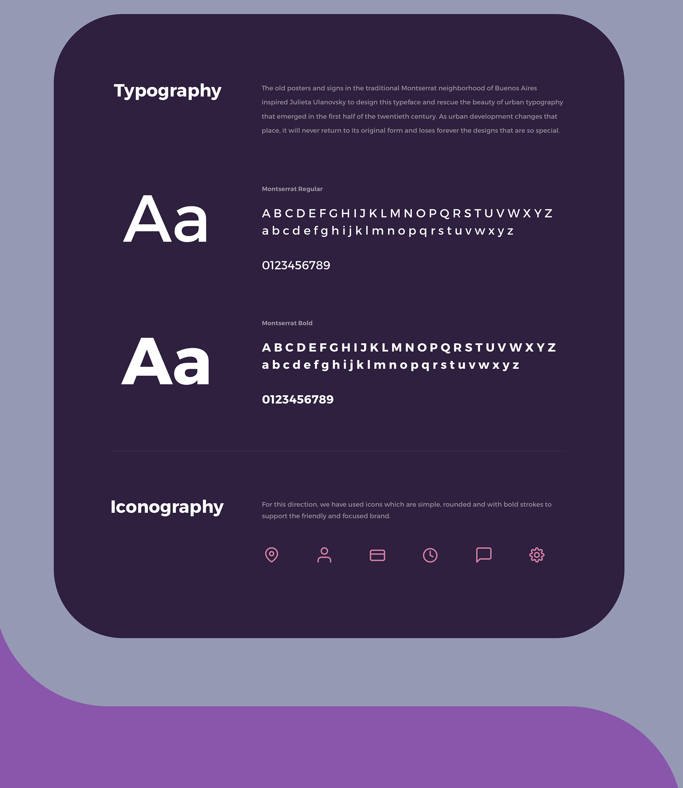
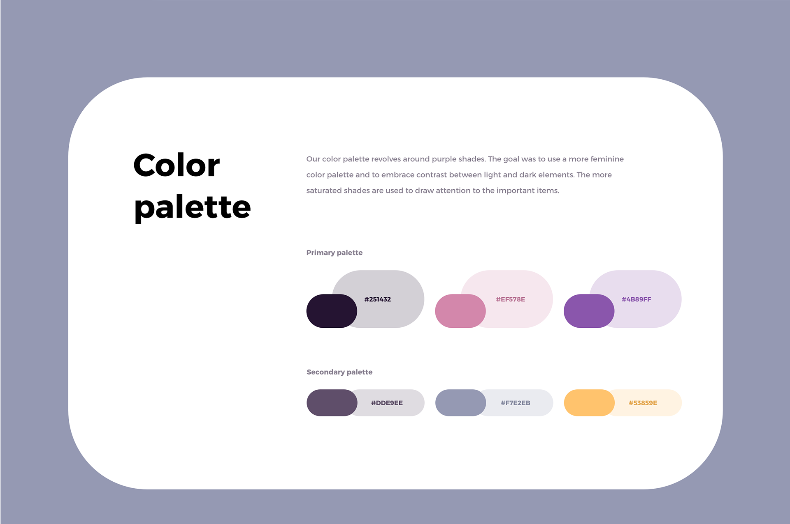

# Activities & Profile Designs

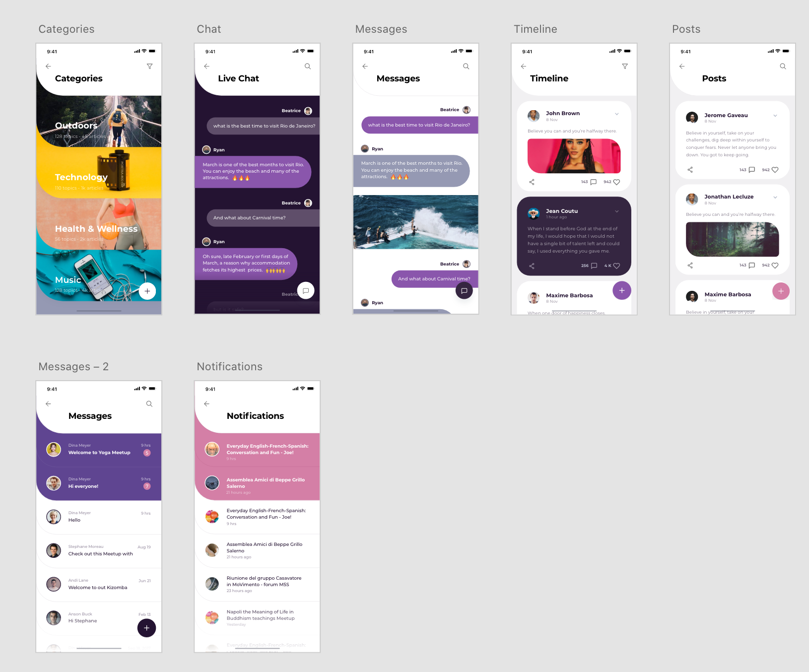

# Onboarding Designs
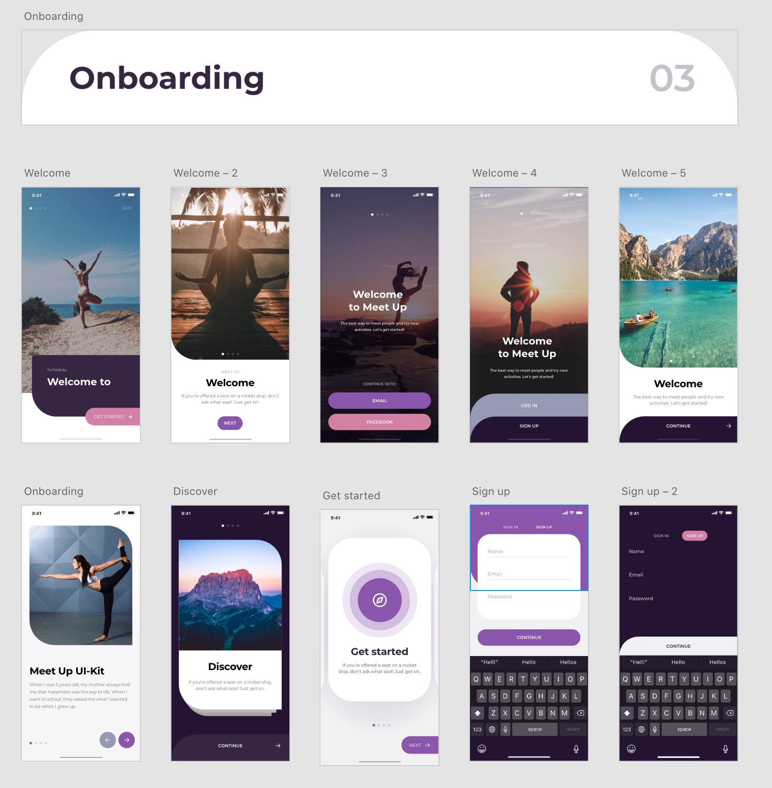

# Menus
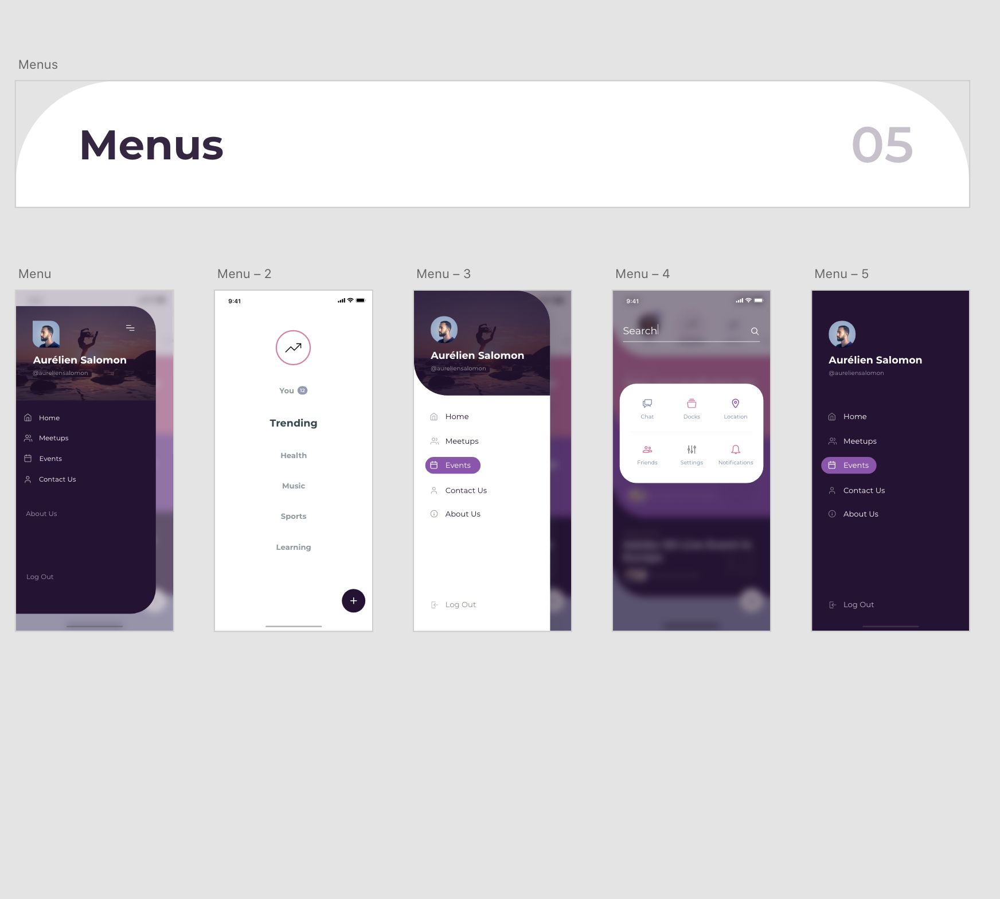

# Dialogs and BottomSheets
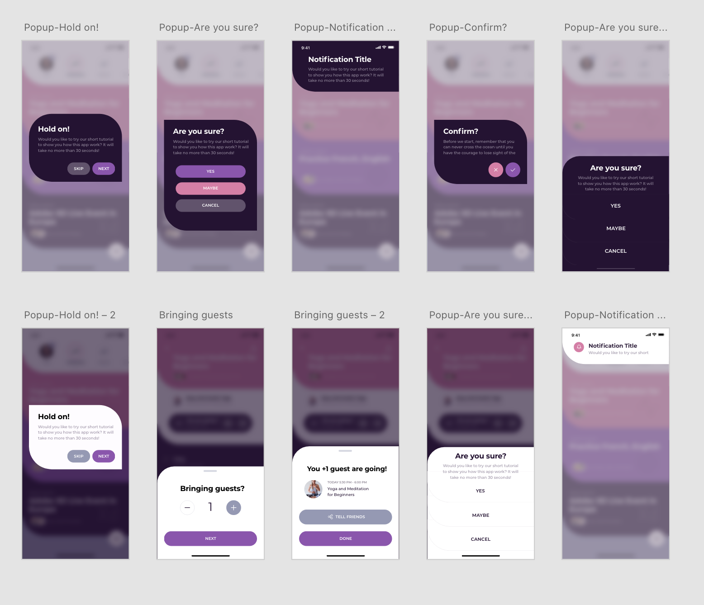

# Stats & Info Designs
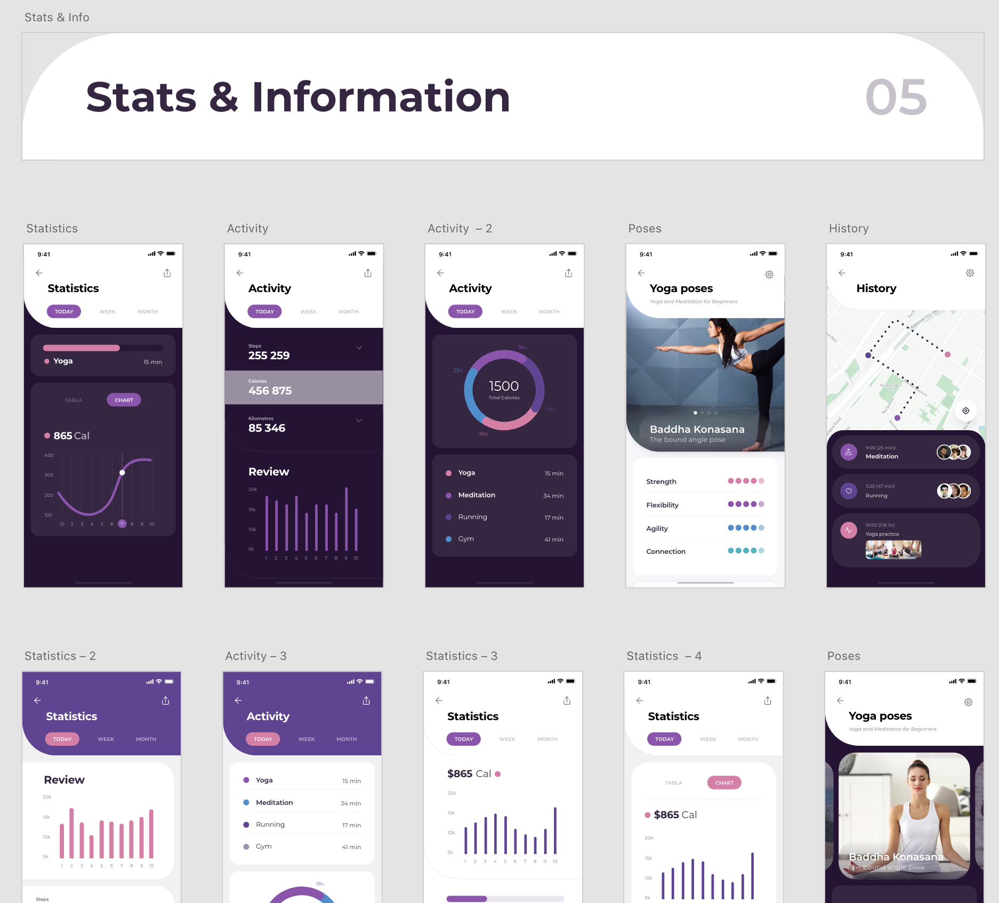